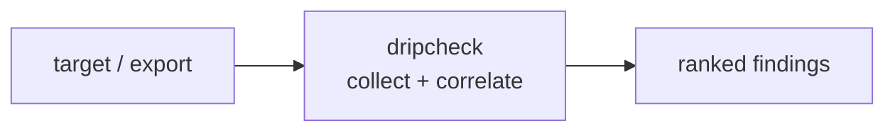

<a name="top"></a>

<div align="center">


# DRIPCHECK


### Lint email sequences and drip campaigns for deliverability: SPF/DKIM/DMARC, link health, unsubscribe presence, and CAN-SPAM/GDPR compliance.


[](https://pypi.org/project/cognis-dripcheck/) [](https://github.com/cognis-digital/dripcheck/actions) [](LICENSE) [](https://github.com/cognis-digital)


*Part of the Cognis Neural Suite.*


</div>


```bash

pip install cognis-dripcheck

dripcheck lint sequence.json   # → prioritized findings in seconds

```


## Usage — step by step

1. **Install** the CLI:
   ```bash
   pip install dripcheck
   ```

2. **Lint an email sequence** described in a JSON file (or `-` to read from stdin):
   ```bash
   dripcheck lint sequence.json
   ```

3. **Pipe a sequence in** from another step:
   ```bash
   cat sequence.json | dripcheck lint -
   ```

4. **Read the output.** Pick the format your workflow speaks — `table`
   (default), `json`, `sarif` (GitHub code-scanning), or `csv`:
   ```bash
   dripcheck lint sequence.json --format json  > drip.json
   dripcheck lint sequence.json --format sarif > drip.sarif   # upload to code-scanning
   dripcheck lint sequence.json --format csv   > drip.csv     # triage in a spreadsheet
   ```

5. **Wire it into CI** — treat warnings as failures so deliverability regressions block release:
   ```bash
   dripcheck lint sequence.json --strict || exit 1
   ```

6. **Explore the [demos](demos/).** Each `demos/<NN-name>/` folder pairs a
   real-format `sequence.json` with a `SCENARIO.md` (where the data came from,
   the exact command, and how to act on the findings):
   ```bash
   python -m dripcheck lint demos/02-clean-onboarding/sequence.json   # passes
   python -m dripcheck lint demos/03-cold-outreach-saas/sequence.json # fails
   ```

   | Demo | What it shows |
   |---|---|
   | `01-basic` | A small mixed cold/drip sequence with seeded problems |
   | `02-clean-onboarding` | A fully compliant onboarding drip — the green baseline |
   | `03-cold-outreach-saas` | B2B cold outreach: fake `RE:`/`FWD:`, missing footers |
   | `04-promo-spam-traps` | A promo that maxes out spam-trigger signals |
   | `05-duplicate-subjects` | Clean emails but a sequence-level duplicate-subject smell (`--strict`) |
   | `06-html-link-heavy` | HTML link-roundup parsing + too-many-links / low-text-ratio |
   | `07-gdpr-eu-newsletter` | EU/GDPR send with a recognised non-US postal address |
   | `08-stdin-ci-gate` | Piping from stdin and using the exit code as a CI gate |
   | `09-broken-edge-cases` | Missing subject, empty body, oversized subject |

## Contents


- [Why dripcheck?](#why) · [Features](#features) · [Quick start](#quick-start) · [Example](#example) · [Architecture](#architecture) · [AI stack](#ai-stack) · [How it compares](#how-it-compares) · [Integrations](#integrations) · [Install anywhere](#install-anywhere) · [Related](#related) · [Contributing](#contributing)


<a name="why"></a>

## Why dripcheck?


A pre-send CI gate — break the build if a campaign is missing an unsubscribe link or trips a spam trigger, before it ever hits a prospect's inbox.


`dripcheck` is single-purpose, scriptable, and self-hostable: point it at a target, get prioritized results in the format your workflow already speaks (table · JSON · SARIF), gate CI on it, and let agents drive it over MCP.


<div align="right"><a href="#top">↑ back to top</a></div>


<a name="features"></a>

## Features


- ✅ CAN-SPAM checks: unsubscribe/opt-out mechanism + physical postal address

- ✅ International address detection (US `City, ST ZIP` **and** EU/FR/DE/ES/IT footers)

- ✅ Spam-trigger word density (subject + body), ALL-CAPS / `!!!`·`$$$` punctuation

- ✅ Deceptive `RE:`/`FWD:` subjects, missing/oversized subjects, empty bodies

- ✅ HTML-aware link checks: too-many-links + low text-to-link ratio

- ✅ Sequence-level checks (e.g. duplicate subjects across the drip)

- ✅ Output as **table · JSON · SARIF · CSV**; `--strict` CI gate via exit code

- ✅ Runs on Linux/macOS/Windows · Docker · devcontainer

- ✅ Ports in Python, JavaScript, Go, and Rust (`ports/`)


<div align="right"><a href="#top">↑ back to top</a></div>


<a name="quick-start"></a>

## Quick start


```bash

pip install cognis-dripcheck

dripcheck --version

dripcheck lint sequence.json                  # lint a drip sequence

dripcheck lint sequence.json --format json    # machine-readable

dripcheck lint sequence.json --format sarif   # GitHub code-scanning

dripcheck lint sequence.json --strict         # CI gate (non-zero exit)

```


<div align="right"><a href="#top">↑ back to top</a></div>


<a name="example"></a>

## Example


```text

$ dripcheck lint demos/03-cold-outreach-saas/sequence.json

DRIPCHECK report
============================================================

[cold-1] quick question about your data pipeline
  ERROR no-unsubscribe: No unsubscribe/opt-out mechanism found (CAN-SPAM 15 U.S.C. 7704).
  ERROR no-physical-address: No valid physical postal address detected (CAN-SPAM requires one).

[cold-2] RE: quick question about your data pipeline
  WARN  deceptive-subject: Subject starts with RE:/FW: which can be deceptive for a cold send.
  ERROR no-unsubscribe: No unsubscribe/opt-out mechanism found (CAN-SPAM 15 U.S.C. 7704).
  ...

------------------------------------------------------------
emails=3  errors=5  warnings=2  FAIL

```


<div align="right"><a href="#top">↑ back to top</a></div>


<a name="architecture"></a>

## Architecture





<div align="right"><a href="#top">↑ back to top</a></div>


<a name="ai-stack"></a>

## Use it from any AI stack


`dripcheck` is interoperable with every popular way of using AI:


- **MCP server** — `dripcheck mcp` (Claude Desktop, Cursor, Cognis.Studio, [uncensored-fleet](https://github.com/cognis-digital/uncensored-fleet))

- **OpenAI-compatible / JSON** — pipe `dripcheck lint sequence.json --format json` into any agent or LLM

- **LangChain · CrewAI · AutoGen · LlamaIndex** — wrap the CLI/JSON as a tool in one line

- **CI / scripts** — exit codes + SARIF for non-AI pipelines


<div align="right"><a href="#top">↑ back to top</a></div>


<a name="how-it-compares"></a>

## How it compares


| | **Cognis dripcheck** | mail-tester.com + textlint, echoing GlockApps |

|---|:---:|:---:|

| Self-hostable, no account | ✅ | varies |

| Single command, zero config | ✅ | ⚠️ |

| JSON + SARIF for CI | ✅ | varies |

| MCP-native (AI agents) | ✅ | ❌ |

| Polyglot ports (JS/Go/Rust) | ✅ | ❌ |

| Open license | ✅ COCL | varies |


*Built in the spirit of **mail-tester.com + textlint, echoing GlockApps**, re-framed the Cognis way. Missing a credit? Open a PR.*


<div align="right"><a href="#top">↑ back to top</a></div>


<a name="integrations"></a>

## Integrations


Pipes into your stack: **SARIF** for code-scanning, **JSON** for anything, an **MCP server** (`dripcheck mcp`) for AI agents, and a webhook forwarder for SIEM/Slack/Jira. See [`docs/INTEGRATIONS.md`](docs/INTEGRATIONS.md).


<div align="right"><a href="#top">↑ back to top</a></div>


<a name="install-anywhere"></a>

## Install — every way, every platform


```bash

pip install "git+https://github.com/cognis-digital/dripcheck.git"    # pip (works today)

pipx install "git+https://github.com/cognis-digital/dripcheck.git"   # isolated CLI

uv tool install "git+https://github.com/cognis-digital/dripcheck.git" # uv

pip install cognis-dripcheck                                          # PyPI (when published)

docker run --rm ghcr.io/cognis-digital/dripcheck:latest --help        # Docker

brew install cognis-digital/tap/dripcheck                             # Homebrew tap

curl -fsSL https://raw.githubusercontent.com/cognis-digital/dripcheck/main/install.sh | sh

```


| Linux | macOS | Windows | Docker | Cloud |

|---|---|---|---|---|

| `scripts/setup-linux.sh` | `scripts/setup-macos.sh` | `scripts/setup-windows.ps1` | `docker run ghcr.io/cognis-digital/dripcheck` | [DEPLOY.md](docs/DEPLOY.md) (AWS/Azure/GCP/k8s) |


<div align="right"><a href="#top">↑ back to top</a></div>


<a name="related"></a>

## Related Cognis tools


- [`warmline`](https://github.com/cognis-digital/warmline) — Score and rank inbound/outbound leads from a YAML rulebook, emitting a ranked queue as JSON/CSV for your SDRs and CI gates.

- [`coldforge`](https://github.com/cognis-digital/coldforge) — Render personalized cold-outreach sequences from Markdown templates + a contacts CSV, with spam-score linting and per-send dry-run preview.

- [`pactgen`](https://github.com/cognis-digital/pactgen) — Generate branded sales proposals and SOWs from a YAML scope file + pricing table into PDF/HTML, with a deterministic line-item math check.

- [`crmsync`](https://github.com/cognis-digital/crmsync) — Bidirectional, idempotent sync of contacts/deals between a local SQLite source-of-truth and CRM APIs (HubSpot/Pipedrive/Salesforce) via one config.

- [`dealflow`](https://github.com/cognis-digital/dealflow) — Model your sales pipeline as a YAML state machine and compute conversion rates, stage velocity, and weighted forecast straight from CRM exports.

- [`introbot`](https://github.com/cognis-digital/introbot) — Find warm-intro paths through your team's combined network graph and draft double-opt-in intro requests from a single contacts manifest.


**Explore the suite →** [🗂️ all 170+ tools](https://github.com/cognis-digital/cognis-neural-suite) · [⭐ awesome-cognis](https://github.com/cognis-digital/awesome-cognis) · [🔗 cognis-sources](https://github.com/cognis-digital/cognis-sources) · [🤖 uncensored-fleet](https://github.com/cognis-digital/uncensored-fleet) · [🧠 engram](https://github.com/cognis-digital/engram)


<div align="right"><a href="#top">↑ back to top</a></div>


<a name="contributing"></a>

## Contributing


PRs, new rules, and demo scenarios are welcome under the collaboration-pull model — see [CONTRIBUTING.md](CONTRIBUTING.md) and [SECURITY.md](SECURITY.md).


> ### ⭐ If `dripcheck` saved you time, **star it** — it genuinely helps others find it.


## Interoperability

`{}` composes with the 300+ tool Cognis suite — JSON in/out and a shared
OpenAI-compatible `/v1` backbone. See **[INTEROP.md](INTEROP.md)** for the
suite map, composition patterns, and reference stacks.

## License


Source-available under the **Cognis Open Collaboration License (COCL) v1.0** — free for personal, internal-evaluation, research, and educational use; **commercial / production use requires a license** (licensing@cognis.digital). See [LICENSE](LICENSE).


---


<div align="center"><sub><b><a href="https://cognis.digital">Cognis Digital</a></b> · one of 170+ tools in the <a href="https://github.com/cognis-digital/cognis-neural-suite">Cognis Neural Suite</a> · <i>Making Tomorrow Better Today</i></sub></div>

